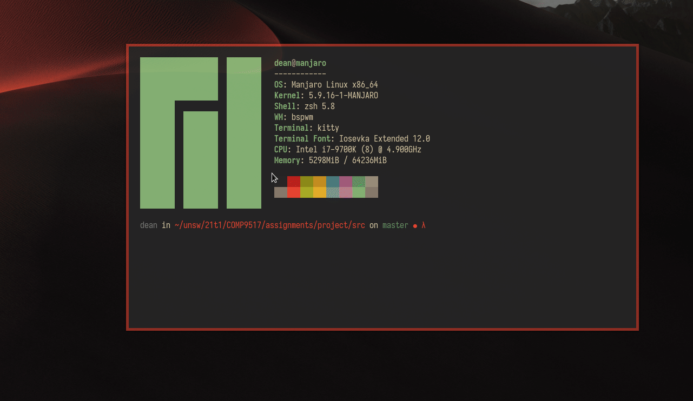

# Todo
- [X] Make labelling tool for clips
- [X] Make clip visualiser tool
- [ ] Label ~10 clips to make a small evaluation set

# Bulletin Board
- 8/4/2021 - Daniel: Please make sure you have a models/ folder if you want to run the detection classifier.
- 7/6/2021 - Dean: Make labelling tool and labelled clip visualiser.
- 6/6/2021 - Dean: Moved datasets to data/ folder for labelling (please do this locally).
- 4/6/2021 - Welcome to the start of a long nightmare. As everyone's detection algorithm is poor, please use the labels for now for the bounding boxes until a better detection algorithm is created.

# Usage
## data/labeller.py
Manually label clips starting at `clip_number`/`frame_number` from `source_clips_path`. Outputs copies of images to `paths_to_outputs` (e.g. see evaluation/clips). With no arguments, default options will be used.
``` console
python labeller.py [ --clip | -c ] clip_number
                   [ --frame | -f ] frame_number
                   [ --src | -s ] source_clips_path
                   [ --dst | -d ] path_to_outputs
```
#### Example
``` console
$ cd data
$ python labeller.py --clip 2 --frame 3
```

## data/watch_clip.py
``` console
python watch_clip.py  [ --clip | -c ] clip_number
                      [ --src | -s ] source_clips_path
```
#### Example
``` console
$ cd data
$ python watch_clip.py --clip 1
```

# Setup

Please download and extract the zip files in both:
1. VELOCITY ESTIMATION CHALLENGE
2. LANE DETECTION CHALLENGE 

From https://github.com/TuSimple/tusimple-benchmark/issues/3
by Kivinju (on github)

Then extract the zip files, there now should be 5 folders 
located at the root of this folder:
1. train_set
2. test_set
3. benchmark_velocity_train
4. benchmark_velocity_test
5. benchmark_velocity_supp

This is to keep things consistent. Also, please ensure no generated files
e.g. generated images are stored on the github. Add the folders to .gitignore ^_^

_________________________________________________

Helpful Links:
https://unsw-my.sharepoint.com/personal/z5195702_ad_unsw_edu_au/_layouts/15/onedrive.aspx?id=%2Fpersonal%2Fz5195702%5Fad%5Funsw%5Fedu%5Fau%2FDocuments%2FLane%20Detection%20Data%20Subset&originalPath=aHR0cHM6Ly91bnN3LW15LnNoYXJlcG9pbnQuY29tLzpmOi9nL3BlcnNvbmFsL3o1MTk1NzAyX2FkX3Vuc3dfZWR1X2F1L0VucVlpRnhULTRaTWlsbS04b1ZsVXVzQk1qOGg0cExDbFpNd2Z0VEtNbVRxZkE%5FcnRpbWU9ek02MVo1bjQyRWc

For train_set as train_set is ~10gb.
However, do not use this for the final submission.... (You can use this to start early and dl giant dataset overnight)


